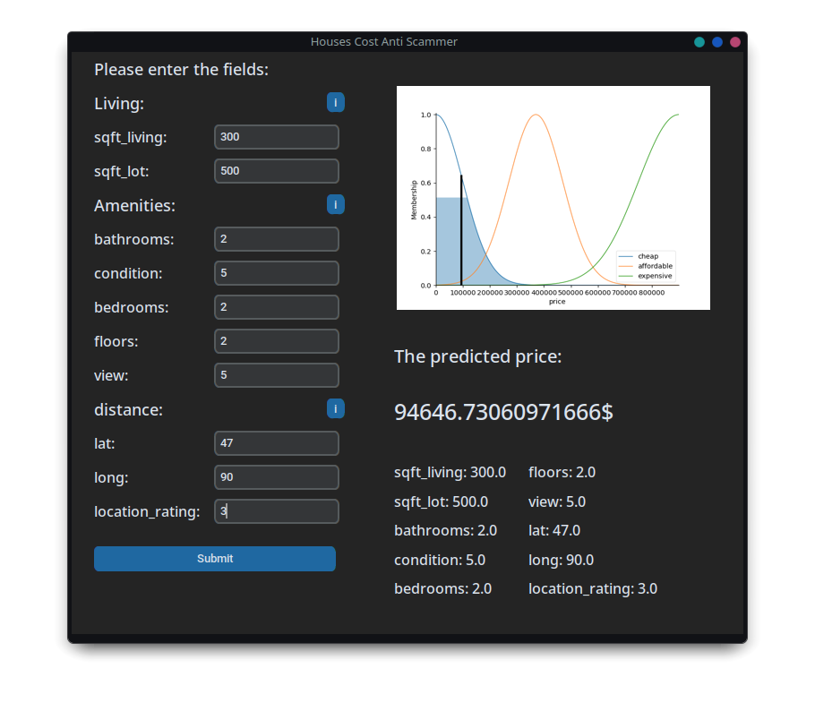

# houses-cost-anti-scammer

An experimental houses prices estimator using fuzzy logic.

The predictor makes used on location based on the distance from the [King County city center](https://en.wikipedia.org/wiki/King_County,_Washington)

## We implement two different systems:
### Complex (on main branch)
Based on statiscal data of the houses in King County.

### Simple (on simple branch)
Based on heuristics and common sense.

## License
[Unlicense](LICENSE)
